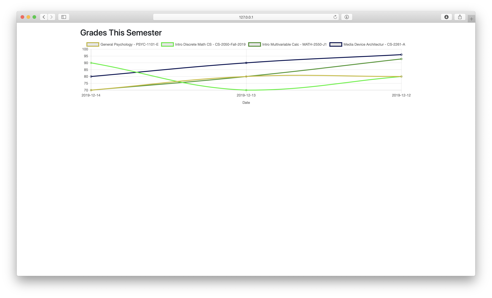

# Grades Graph
##### See how your grades have trended over the course of the semester

## How it works
This uses a cron job to check [Canvas](https://canvas.instructure.com) for your grades every day. This data is stored in a MySQL database and then presented in the form of a chart that allows you to see how your grades have been trending over the course of the semester.

## Installation
1. Update the database credentials in `config example.ini`
2. Rename `config example.ini` to `config.ini`
3. 1. Get an API key from Canvas
   1. Navigate to `Account` > `Settings` > `Approved Integrations`
   2. Click `+ Create New Access Token`
   3. Be sure to leave the expiration date blank
   4. Copy the token into your `config.ini` as `api_key`
4. Place the code on a server capable of running PHP
5. Create a table using the `CREATE TABLE` command found in this repo (`table.txt`)
6. Setup a cron job to run `cron.py` every day

### Disclaimer
Many professors don't use the standard Canvas grading system for how they calculate your real final grade. This system will only show what Canvas calculates as your overall grade.
Some professors don't even let Canvas show you a grade. In cases like this, this utility will record the grade as a 0.
